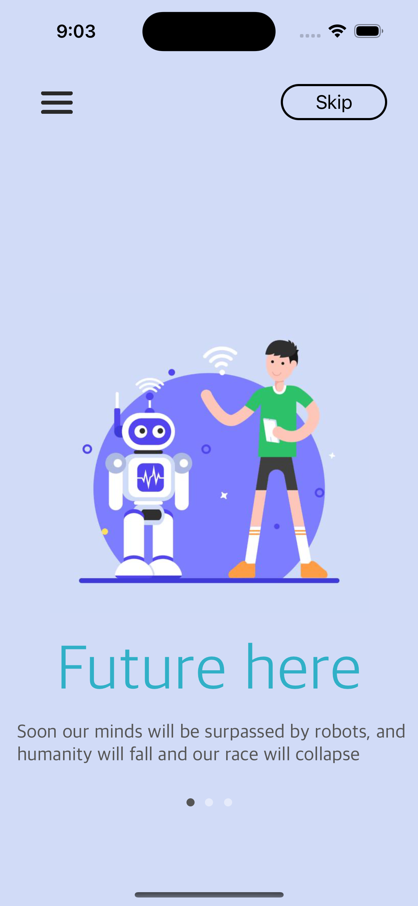
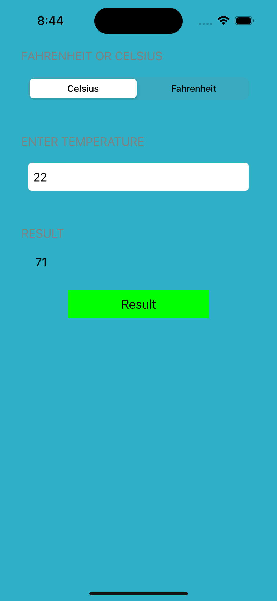

# UIProgrammatically
## Code practice. Create an interface with code/programmatically

- I am learning how to create interfaces using code.

--- 

### 📲 Apps

| App.                                                            | Image             |
| ----------------------------------------------------------------| :---------------: |
| Boy Waving Hello            |   |
| Temperature Conversion      |   |

